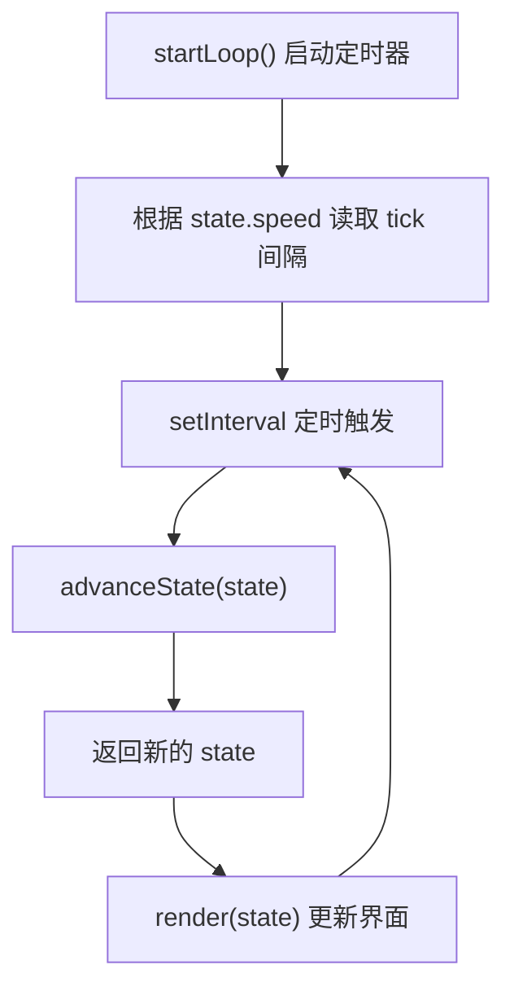
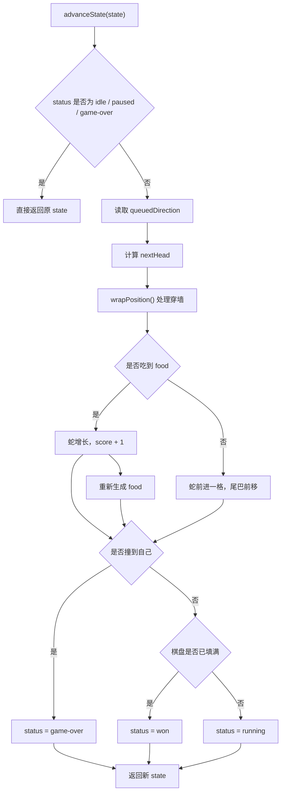
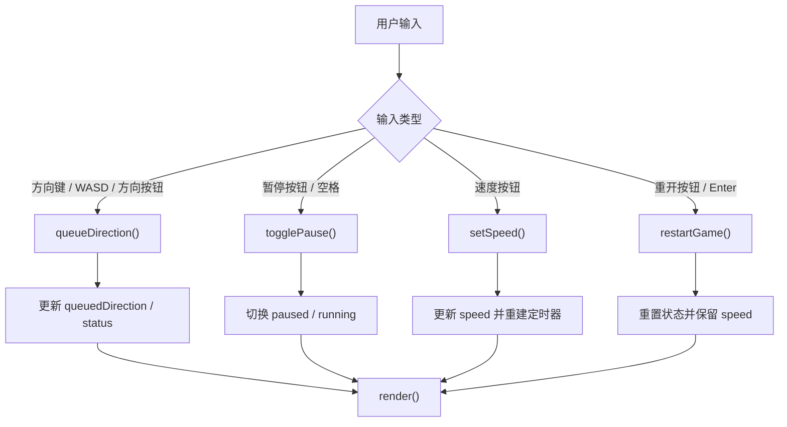

# 游戏逻辑文档

本文档用于后续交接，帮助快速理解当前贪吃蛇实现的职责拆分、状态结构和运行流程。

## 1. 模块职责

### `src/game.js`

纯逻辑模块，不依赖 DOM。

负责内容：

- 初始化游戏状态
- 处理方向切换
- 处理暂停与重开
- 处理速度切换
- 推进一帧游戏状态
- 生成食物
- 判断是否撞蛇身
- 处理穿墙位置换算

这个文件适合放规则改动和测试驱动开发。

### `src/app.js`

页面交互模块，负责把逻辑状态映射到浏览器界面。

负责内容：

- 查询页面元素
- 绑定键盘事件和按钮事件
- 启动定时器
- 根据当前状态渲染棋盘
- 更新文案、分数和按钮选中态

这个文件适合放 UI 交互改动。

## 2. 状态结构

游戏运行时的核心状态对象由 `createInitialState()` 返回，字段如下：

- `gridSize`：棋盘边长，当前是 `16`
- `snake`：蛇身数组，`snake[0]` 是蛇头
- `direction`：当前实际移动方向
- `queuedDirection`：下一帧将采用的方向
- `food`：当前食物坐标，格式为 `{ x, y }`
- `speed`：当前速度，取值为 `slow / normal / fast`
- `score`：当前分数
- `status`：当前状态，可能是 `idle / running / paused / game-over / won`
- `tick`：已推进的帧数

这种结构的好处是：逻辑层可以直接测试，不需要依赖页面环境。

## 3. 主循环

主循环在 `src/app.js` 中的 `startLoop()` 里启动：

1. 根据当前 `state.speed` 读取毫秒间隔
2. 创建 `setInterval`
3. 每次触发时调用 `advanceState(state)`
4. 用新的 `state` 重新渲染页面

速度映射定义在 `src/game.js`：

- `slow`: `320ms`
- `normal`: `220ms`
- `fast`: `150ms`

默认速度是 `slow`。

### 主循环流程图

## 4. 开始、暂停、重开

### 开始

游戏初始状态是 `idle`，不会自动移动。

当玩家第一次输入有效方向时：

- `queueDirection()` 会更新 `queuedDirection`
- 同时把 `status` 从 `idle` 切为 `running`

### 暂停

点击暂停按钮或按空格时，会调用 `togglePause()`：

- `running` 或 `idle` 会切换到 `paused`
- `paused` 会切回 `running`
- `game-over` 不允许继续切换

### 重开

点击 `再来一次` 或在结束后按 `Enter` 时：

- 调用 `restartGame({ speed: state.speed })`
- 会重建蛇、食物、分数和状态
- 当前速度会保留

## 5. 方向控制

方向定义在 `DIRECTIONS` 常量中：

- `UP`
- `DOWN`
- `LEFT`
- `RIGHT`

`queueDirection()` 会阻止立即反向，例如：

- 当前向右，下一次不能直接切成向左
- 当前向上，下一次不能直接切成向下

这样可以避免因为瞬时反向导致蛇头直接撞上自己。

## 6. 一帧逻辑如何推进

`advanceState(state, rng)` 是核心规则入口。

每推进一帧时，主要流程如下：

1. 如果状态是 `idle / paused / game-over`，直接返回原状态
2. 取出下一步方向 `queuedDirection`
3. 计算新蛇头位置
4. 对新位置执行穿墙换算 `wrapPosition()`
5. 判断是否吃到食物
6. 判断新蛇头是否撞到蛇身
7. 更新蛇身数组
8. 如果吃到食物，则加分并重新生成食物
9. 如果棋盘被占满，则状态切为 `won`
10. 否则状态保持 `running`

### 单帧推进流程图

## 7. 穿墙规则

当前版本为了降低儿童玩家失败成本，采用穿墙规则而不是撞墙结束。

处理函数为 `wrapPosition(position, gridSize)`：

- 超出左边时，从右边出现
- 超出右边时，从左边出现
- 超出上边时，从下边出现
- 超出下边时，从上边出现

`hitsWall()` 目前仍保留在逻辑层中，主要用于测试和后续如果想切回“撞墙结束”模式时复用。

## 8. 食物生成规则

`spawnFood(snake, gridSize, rng)` 的逻辑是：

1. 遍历所有棋盘格子
2. 过滤掉已被蛇占用的位置
3. 在剩余空位中随机取一个位置作为食物

为了便于测试，这个函数支持注入 `rng`，所以测试里可以控制随机结果，避免不稳定。

## 9. 碰撞规则

当前版本的碰撞规则是：

- 撞墙：不会结束，会穿墙
- 撞自己：结束游戏

自撞判断时有一个细节：

- 如果这一帧没有吃到食物，则蛇尾会移动
- 所以碰撞判断会忽略“本帧将要离开的尾巴”
- 如果这一帧吃到了食物，则蛇尾不移动，整条蛇都参与碰撞判断

这个细节在 `advanceState()` 中通过 `snakeToCheck` 处理。

## 10. 渲染流程

`render(currentState)` 负责把状态显示到页面：

1. 先清空所有格子的视觉状态
2. 给蛇身位置加上 `snake` 样式
3. 给蛇头位置额外加上 `snake-head` 样式
4. 给食物位置加上 `food` 样式
5. 更新分数文本
6. 更新暂停按钮文案
7. 更新状态提示文本
8. 更新速度按钮的选中状态

棋盘格子只在初始化时构建一次，后续渲染只改 class，不重复创建 DOM。

## 11. 输入来源

当前支持两类输入：

### 键盘

- 方向键
- `WASD`
- 空格：暂停 / 继续
- `Enter`：游戏结束后重开

### 页面按钮

- `上 / 下 / 左 / 右`
- `慢 / 普通 / 快`
- `暂停`
- `再来一次`

### 输入到状态更新流程图

## 12. 测试覆盖

测试文件在 `tests/game.test.js`，当前覆盖内容包括：

- 正常移动
- 吃到食物后的增长和加分
- 穿墙行为
- 自撞结束
- 食物只生成在空位
- 禁止立即反向
- 速度切换
- 非法速度值忽略
- 重开时保留速度
- 速度与毫秒间隔映射
- 默认速度为慢
- `hitsWall()` 的保留行为

目前测试集中在规则层，没有对 DOM 渲染做浏览器级测试。

## 13. 后续改动建议

如果后续需要继续迭代，建议按下面边界修改：

- 改规则：优先改 `src/game.js`
- 改 UI 文案或按钮布局：优先改 `src/app.js` 和 `styles.css`
- 加测试：优先补 `tests/game.test.js`

如果后面要支持更多玩法模式，建议下一步把“模式配置”抽成独立对象，例如：

- 是否穿墙
- 默认速度
- 是否允许暂停
- 是否有儿童模式提示语

这样可以更方便扩展“经典模式”和“儿童模式”两套规则。

## 14. 文档维护约定

为了便于后续交接，后面的代码改动需要同步维护文档。

推荐按下面规则执行：

- 改 `src/game.js`：同步检查本文档的“状态结构”“主循环”“碰撞规则”“测试覆盖”
- 改 `src/app.js` 或 `index.html`：同步检查 `README.md` 的“游戏操作”“项目结构”，以及本文档的“输入来源”“渲染流程”
- 改 `package.json`：同步检查 `README.md` 的“启动方式”
- 新增文件或目录：同步检查 `README.md` 的“项目结构”
- 新增或删除测试：同步检查本文档的“测试覆盖”

建议把“代码变更 + 文档同步”视为同一个任务，不要拆成两次补做。
